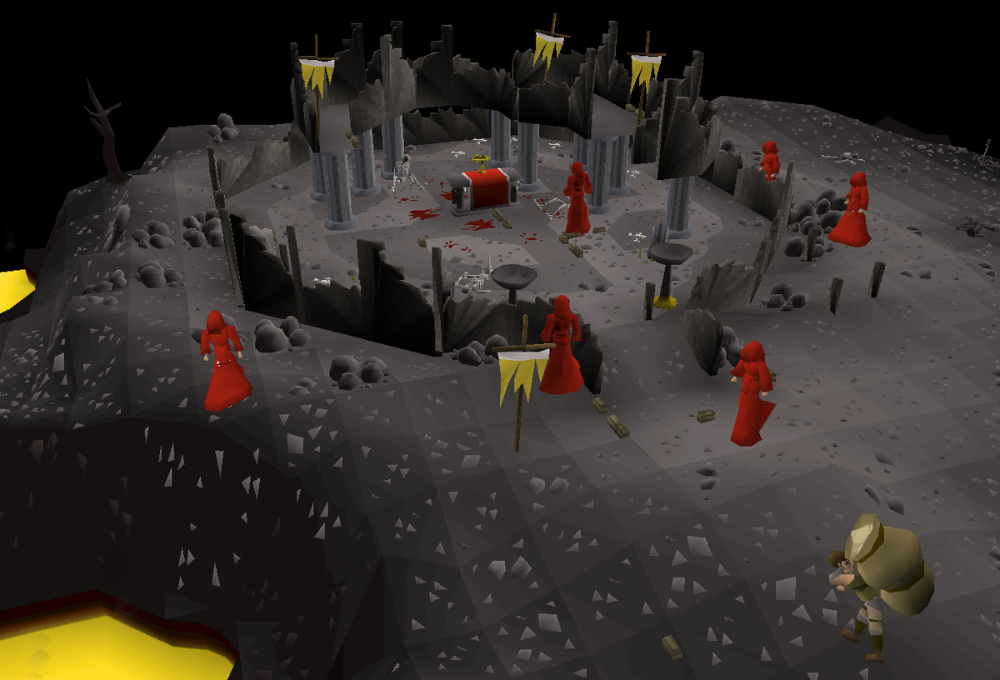

<!-- PROJECT LOGO -->
<br />
<p align="center">
  <a href="https://github.com/MarcoGDev/ChaosAltar/">
    
  </a>

  <h3 align="center">Chaos_Altar_Bury</h3>


<!-- TABLE OF CONTENTS -->
<details open="open">
  <summary>Table of Contents</summary>
  <ol>
    <li><a href="#about-the-project">About The Project</a></li>
    <li><a href="#Getting-started">Getting started</a></li>
    <li><a href="#Prerequisites">Prerequisites</a></li>
        <li><a href="#Built-With">Built-With</a></li>
  </ol>
</details>


<!-- ABOUT THE PROJECT -->
## About The Project
Oldschool Runescape RSPeer prayer training script. Pakt botten op bij de Chaos altar, begraaft ze, en hopt worlds zodra er geen botten meer zijn in de huidige wereld.

## Getting started
Installeer Java & RSPeer en voeg dit script toe aan RSpeer. Start het script bij de Chaos Altar in de wilderness.

* Starting location


## Prerequisites
* Java
  ```sh
  Install OpenJDK @ https://adoptopenjdk.net/  
  ```

* RSPeer
   ```sh
  Install client @ https://rspeer.org/resources/download/  
  ```

# Built With
* [Java](https://www.java.com/nl/)
* [RSPeer API](https://rspeer.nyc3.cdn.digitaloceanspaces.com/front-site/javadocs/index.html)
